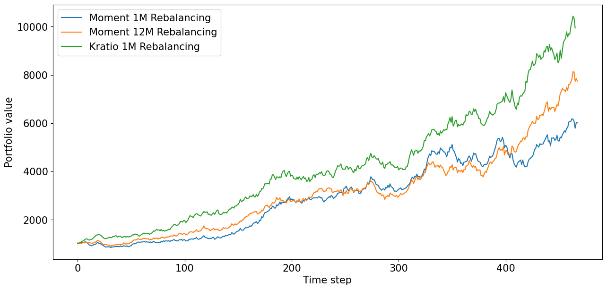

# K-ratio 모멘텀 팩터 테스트

- K-ratio로 측정한 모멘텀을 기반으로 팩터 투자 테스트
- K-ratio는 변동성 대비 누적 수익률의 회귀 기울기 값이며 
- 꾸준한 우상향 차트를 갖는 종목에서 높은 값을 갖는다. 
- 직접 구현한 백테스팅 모듈을 사용 (PMENV)

# Overview

***Moment 1M Rebalancing***
- 단순 변화율 기반 모멘텀을 사용하여 1개월마다 리밸런싱
- MDD: 22.7726

***Moment 12M Rebalancing***
- 단순 변화율 기반 모멘텀을 사용하여 12개월마다 리밸런싱
- MDD: 21.1788

***Moment 1M Rebalancing***
- K-ratio 기반 모멘텀을 사용하여 1개월마다 리밸런싱
- MDD: **14.4313**
